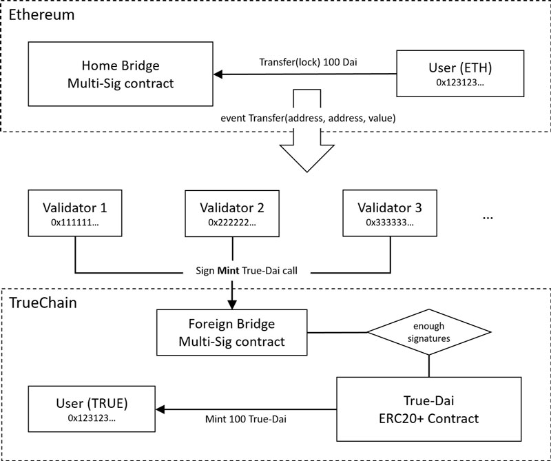
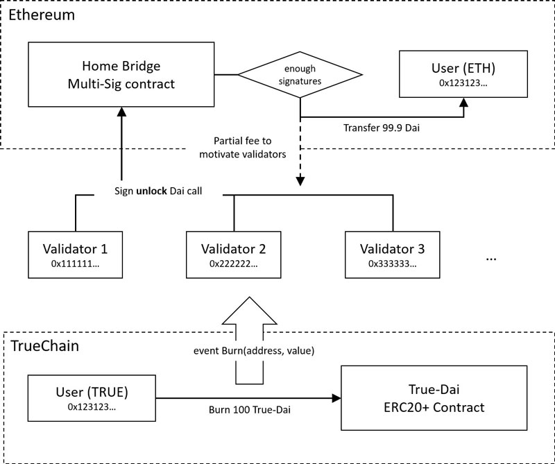

# Example: TRUE-DAI bridge Document

## Token bridge introduction

* The TRUE-ETH Dai Token Bridge includes two multi-sig contracts on two chains, a True-Dai ERC20 contract on TrueChain and several validators vote on cross-chain transactions.

* The solution locks existing Dai on Ethereum and use that as a representation to mint True-Dai on TrueChain.

* Tokens are locked/unlocked/minted/burned on-chain, i.e. through bridge smart contracts on Ethereum and TrueChain respectively. The smart contract functionality is invoked by a set of validators.

* Bridge contract functionality

  * Home bridge (Ethereum): Lock/unlock Dai, temporary storage the fee consumed during redemption
  * Foreign bridge (TrueChain): Mint/burn T-Dai
  * Bridge contracts know which TrueChain/ETH address to transfer to upon lock/mint and burn/unlock scenarios.
  * Multi-Sig acceptance of bridge functions on-chain. All functions can only be executed once a majority vote on-chain for a certain action by the validators has been reached.
    * A number of validators (Oracles) must sign off on the transfer, i.e. 3 out of 4, for a token to be bridged. To be specific, this means 3 out of 4 votes on-chain for a specific event - in this case mint.
    * Consequently, no single entity can execute the bridge functions - it must be a majority of validators signing off on a triggered event, by casting an on-chain vote for action on-chain (i.e. mint).
    * Example: Validators runs an ETH node and TrueChain node that listen for token events on the two chains and cast a vote for a specific transfer to go through. Once a transfer get 3 votes, then the function call will be executed.
    * Validators can be Maker/TrueChain/other trusted parties, (i.e. a dapp company on TrueChain)
    * Only whitelisted validators (a set of verified Ethereum/TrueChain addresses) is able to cast votes on the Multi-Sig functions. Preferably, more validators can be introduced by implementing functions that allow current validators to vote to include new whitelisted addresses.
* Audited source code, and access for Maker.
  * Preferably open source and thus verifiable by community.

### DAI from Ethereum to TrueChain

### Dai from TrueChain to Ethereum

